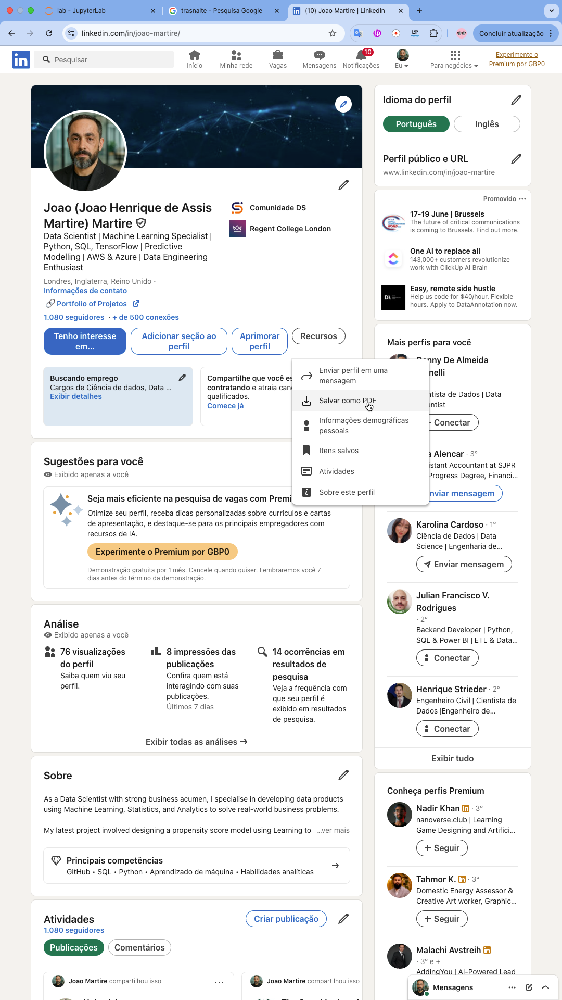

# 📄 Resume Analyzer AI

[](https://resume-analyzer.streamlit.app)
[](LICENSE)
[](https://www.python.org/)

An AI-powered Streamlit app to analyse and review your CV (resume) in both **English 🇬🇧** and **Brazilian Portuguese 🇧🇷**.

> Upload your PDF resume and instantly receive detailed feedback, improvement suggestions, and download AI-generated review reports as PDFs.

---

## 🔥 Features

✅ Upload your CV in PDF format  
✅ AI review in **English** and **Portuguese (Brazil)**  
✅ Scores for:
- Clarity
- Impact
- Suitability for Data Science roles  
✅ Detection of strengths and weaknesses  
✅ Concrete improvement suggestions  
✅ Download reviews in PDF format  
✅ Clean, responsive layout  
✅ Visual guide to export your CV from LinkedIn  

---

## 🖼️ Example – Upload your CV



---

## 🚀 Run Locally

### 1. Clone the repository

```bash
git clone https://github.com/seu-usuario/seu-repositorio.git
cd seu-repositorio
2. Create and activate a virtual environment
bash
Copiar
Editar
python -m venv venv
source venv/bin/activate      # On Mac/Linux
venv\Scripts\activate         # On Windows
3. Install the dependencies
bash
Copiar
Editar
pip install -r requirements.txt
4. Add your Google API Key
Create a file named .env in the root of the project:

ini
Copiar
Editar
GOOGLE_API_KEY="your-google-api-key-here"
🌐 Deploy on Streamlit Cloud
You can easily deploy this app on Streamlit Cloud.
Make sure your repo contains:

streamlit_app.py

requirements.txt

.streamlit/config.toml (for custom theme)

❌ Do not upload your .env — configure your API Key in Streamlit Secrets instead.

📚 Tech Stack
Streamlit

Google Generative AI API

PyMuPDF

FPDF

python-dotenv

👨‍💻 Author
Developed with ❤️ by João Martire
🔗 LinkedIn | Portfolio | GitHub

📜 License
This project is licensed under the MIT License.

perl
Copiar
Editar

---

✅ **Próximos passos**:

1. Substitua `https://github.com/seu-usuario/seu-repositorio.git` pelo seu link real do GitHub.
2. Confirme se o banner (`banner.png`) e o exemplo (`linkedin_example.png`) estão dentro da pasta `images/`.
3. Salve o conteúdo acima no seu `README.md`.

Se quiser, posso gerar o `LICENSE` também ou sugerir o texto do segredo no `Streamlit Cloud`. Des
